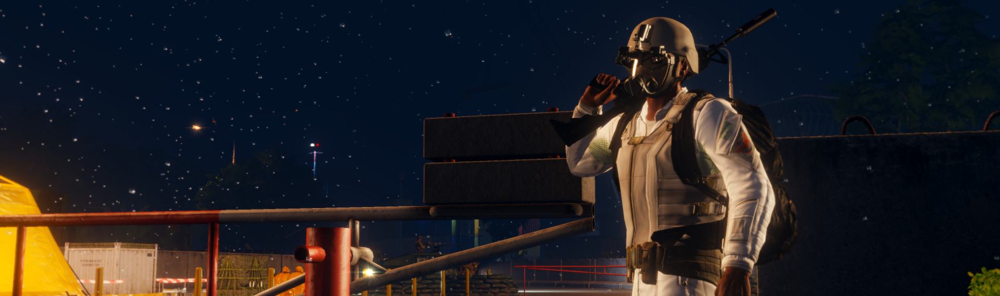
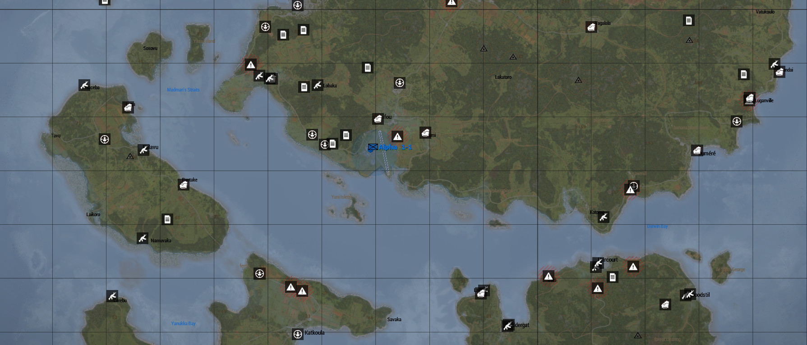

# Zombie-Framework



An open world multiplayer mission inspired by Quiksilver's Invade & Annex
[Apex-Framework], created with the use of [RHSUSAF] and RyanD's
[Zombies and Demons] mod.
You will be working with your team to deal with the widespread infection
and complete objectives across the islands of Tanoa.

We are currently in Alpha development. For developers interested in helping,
please see the [contributing guide]!

## Features

- Procedurally generated main and side missions based on map terrain
- Loitering zombies, hordes, and vehicle wrecks
- *Blood Points* economy for purchasing AI, vehicles, and supplies
- Native self-revive and vehicle unflip actions
- Zombie loot drops based on player equipment
- Customizable with CBA settings (optional)

## How do I play?

You can find this mission published on the Steam Workshop:

- [Zombie Framework (Tanoa)](https://steamcommunity.com/sharedfiles/filedetails/?id=3329328254), ID 3329328254
- [Zombie Framework (Chernarus 2020)](https://steamcommunity.com/sharedfiles/filedetails/?id=3329329231), ID 3329329231

Once subscribed, you can host the mission by going to Server Browser > Host Server,
and then select Zombie Framework from the appropriate map.
You may choose to host LAN if you want to play alone.

For dedicated server hosters, you will need to copy and rename the mission file
from your workshop directory:
1. Navigate to `<Steam>/steamapps/workshop/content/107410/<itemID>`,
   where itemID corresponds to the workshop map you downloaded above.
2. Copy the `<numbers>_legacy.bin` file into your server's `MPMissions` directory.
3. Rename it to `SHZombiesFramework.<terrain>.pbo`, where terrain is the name
   of the map (`Tanoa` or `cup_chernarus_A3`).
4. In your server.cfg, use `SHZombiesFramework.<terrain>` as the template name,
   for example:

   ```cpp
   class Missions {
       class Zombies {
           template = "SHZombiesFramework.Tanoa";
       };
   };
   ```

## ACE Compatibility

[ACE] is not required by this mission but there are various settings configured
for it (see [cba_settings.sqf]), and they can be overwritten by the server as usual.

> [!WARNING]
> Zombies and Demons has issues with ACE Medical, preventing zombies from
> dealing damage. When using [ACE], please install the [ACE No Medical] mod
> alongside it.



[Zombies and Demons]: https://steamcommunity.com/sharedfiles/filedetails/?id=501966277
[RHSUSAF]: https://steamcommunity.com/sharedfiles/filedetails/?id=843577117
[Apex-Framework]: https://github.com/auQuiksilver/Apex-Framework
[contributing guide]: /CONTRIBUTING.md
[ACE]: https://steamcommunity.com/sharedfiles/filedetails/?id=463939057
[cba_settings.sqf]: /SHZombiesFramework.Tanoa/cba_settings.sqf
[ACE No Medical]: https://steamcommunity.com/sharedfiles/filedetails/?id=3053169823
